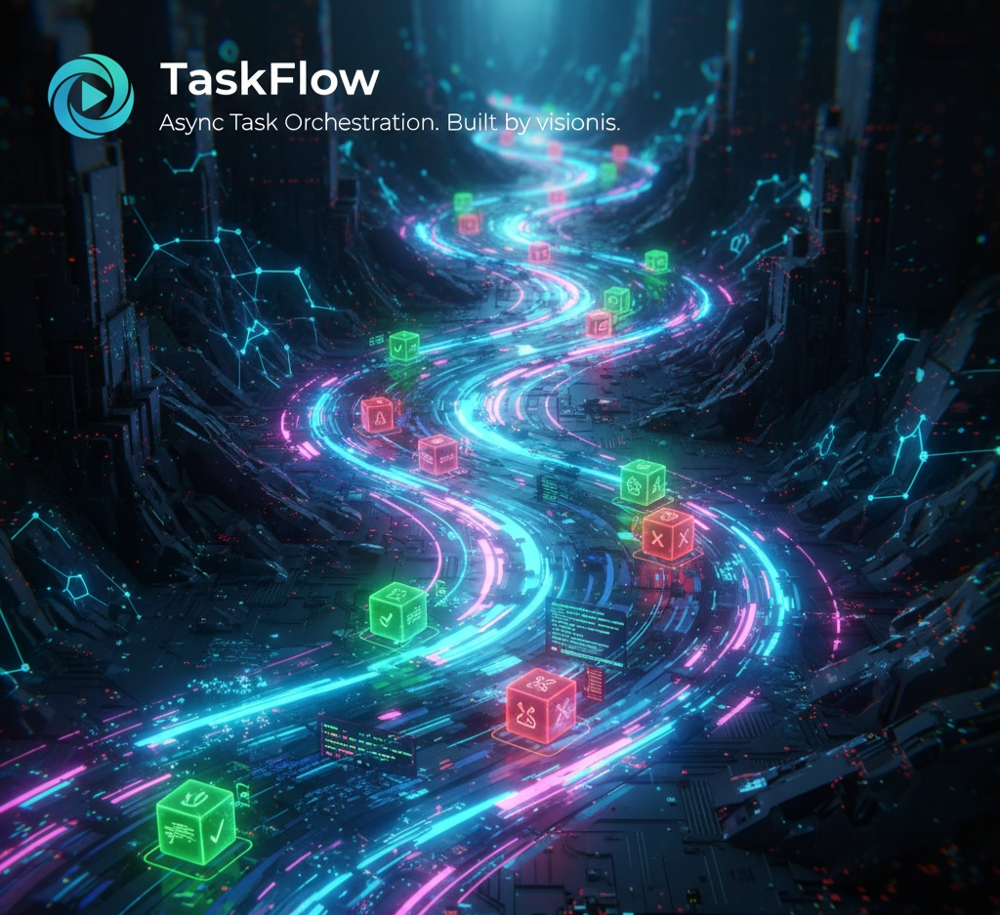

<p align="center">
  
</p>

<div align="center">


</div>


# TaskFlow 🌊

A high-performance, lightweight asynchronous task manager for Python.

## Core Features
- **Concurrent Processing:** Multi-worker architecture built on `asyncio`.
- **Fault Tolerance:** Automated retries with an exponential backoff strategy.
- **Graceful Shutdown:** Ensures all tasks in the flow are completed before exit.
- **Unique Identification:** Every task is assigned a unique UUID for tracking.

## Quick Start
```python
import asyncio
from taskflow import TaskFlowEngine

async def my_handler(data):
    # Simulate processing logic
    print(f"Processing: {data}")

async def main():
    # Initialize engine with 5 workers and 3 retry attempts
    flow = TaskFlowEngine(max_retries=3, workers=5)
    
    # Start the engine
    await flow.start(my_handler)
    
    # Enqueue tasks
    await flow.enqueue({"id": 101, "payload": "Sync Request"})
    await flow.enqueue({"id": 102, "payload": "Database Update"})
    
    # Drain the queue and stop
    await flow.shutdown()

if __name__ == "__main__":
    asyncio.run(main())

Author
Developed by visionis
